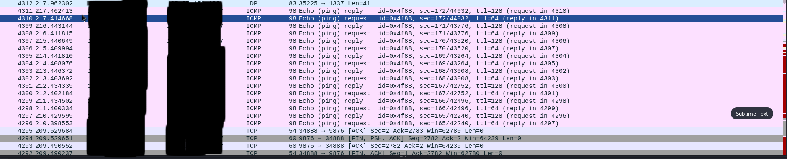
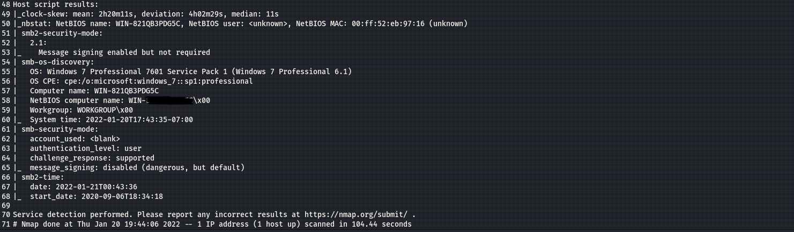

# Keys to the Kingdom
A in depth walkthrough of how I solved a fairly realistic exercise one of my instructors gave me. This exercise was loads of fun and kept me entertained for quite a while with all of its little rabbit holes and misdirects.

### It begins...
This is how it started, with a post from an instructor of mine in our class' Teams channel. "Find the 'Keys' To the Kingdom", he said and then posted a link to a file on google drive along with 3 IP addresses.

#### So we have a couple of clues. 
From just that introduction, I noticed a couple of things that could give me an idea on where to go with this.
1. Keys. I wonder what sort of keys hes talking about? 
It could be a VPN key hidden in that packet capture, but it could also be an SSH key, or knowing him, it could be a misdirection. 

2. Our second clue comes from 2 of those IP's they are one after another in sequence. So it stands to reason they are on the same subnet and can only be accessed via this hypothetical VPN. \

#### Well only one way to find out! Lets open that pcap in Wireshark.

There are a little over 4000 packets in this pcap file but most of them dont tell me much. Theyre all around 90 in length. Maybe hidden within here is something more substantial. So I sort by length and find a file thats a bit longer. 

Thats much better! We found a full openVPN key. With a little research about openVPN keys I find that I can copy this text directly into a file with the extension .ovpn and connect to the range using the command ``sudo openvpn <filenamehere>.ovpn``

#### ***90s hacker voice*** Im in.

## Now, the real fun begins...

I start by enumerating all 3 of the obtained IP addresses using [@dievus'](https://github.com/dievus) fantastic [Threader3000](https://github.com/dievus/threader3000) tool. I truly love this little guy. It makes portscanning so much quicker and more automated by quickly telling you which ports are up and then constructing an nmap scan tailored to that specific target. It only deeply scans the ports that its initial scan previously found to be open, which significantly speeds up your wait time. It also automatically outputs your scans into 3 different file formats which you can reference later. I love Threader3000 and cant sing its praises enough. So go check it out for yourself!
Anyway's, back to port scanning starting with...
## Box 1

Going for the lowhanging fruit (and the best option here), I decide to go check out the website on `port 8080`. Im greeted with a basic admin login page with the url extension `index.php`. This lets gives me an idea that I may be able to preform an sql injection but Im still not sure.

So, I fire up BurpSuite and check out whats happening when i hit the login button.

## Box 2

#### Box 2 pt.2

#### Box 3

While I initially chose to go at all of these boxes at once, organizing myself through diligent note taking, I eventually decided to hit these boxes one at a time to keep all of my thoughts organized. So, that is the way Ill be writing this out from this point forward. 

Starting with the first scan, I see that there is an open http port on 8080 (not the default). So I go and check that site out but there isnt much to look at.
